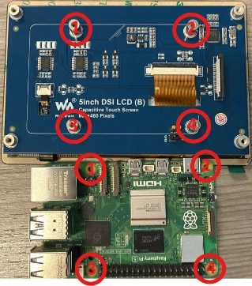
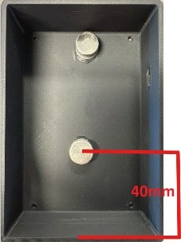

# HOW-TO: Build Tool Log Tablet without Raspberry Pi Flash Software

This guide details the process of building and configuring a Raspberry Pi-based kiosk for the Tool Log system.

## Materials
- One Raspberry Pi 5 (2GB RAM)
- One Power Supply
- One DSI LCD 5in Screen
- One Micro SD Card (8GB)
- One Shell (S0900056)
- Two Magnets
- Two Leather Strips
- Super Glue
- One MicroHDMI-to-HDMI cord for monitor
- One Wired Keyboard
- One Wired Mouse
- Wired WIFI Connection
- A separate Laptop/computer on the same WIFI network

## Step 1: Hardware Assembly
1.  **Insert SD Card:** Insert the Micro SD Card into the Raspberry Pi’s card slot on the underside.
2.  **Attach Screen:** Attach the Raspberry Pi onto the LCD Screen using the four screws provided with the screen.
    -   Ensure the correct orientation: The text “5inch DSI LCD (B)” on the screen should be upright and readable.
    -   The Raspberry Pi should be oriented so the text “HDMI” and “Raspberry Pi 5” are upside down relative to the screen's text.

3.  **Connect Display Cable:** Attach the provided “MIPI-DSI-Cable-12cm” to both the LCD Screen port and the Raspberry Pi “CAM/DISP 0” port. Ensure the pins on the cable make good contact with the pins in the ports.

4.  **Connect Peripherals:** Plug the power supply, monitor (via MicroHDMI-to-HDMI cord), keyboard, mouse, and an Ethernet cable (for wired WIFI connection) into the Raspberry Pi.

## Step 2: OS Installation and Configuration
1.  **Start Installer:** Power on the Raspberry Pi, press and hold the `Shift` key to access the advanced installer.
2.  **Select OS:**
    -   **Raspberry Pi Device:** Select “RASPBERRY PI 5”.
    -   **Operating System:** Select “OTHER” and then “RASPBERRY PI OS LITE (32-BIT)”.
    -   **Storage:** Select “INTERNAL SD CARD READER”.
    -   Click **Next**.
3.  **Customize OS Settings:** When asked “Would you like to apply OS customization settings?”, click “EDIT SETTINGS”.
    -   **General Tab:**
        -   Select “Set username and password”.
            -   **Username:** `pi`
            -   **Password:** `1234`
        -   Select “Configure wireless LAN”.
            -   **SSID:** `IRNA_WIFI`
            -   **Password:** (Enter the appropriate password)
            -   **Wireless LAN country:** `US`
        -   Select “Set locale settings”.
            -   **Time zone:** `America/New_York`
    -   **Services Tab:**
        -   Select “Enable SSH”.
        -   Select “Use password authentication”.
    -   **Options Tab:**
        -   Unselect “Eject media when finished”.
        -   Press **SAVE**.
4.  **Begin Installation:** Click “YES” to apply the settings. When warned that existing data will be erased, click “YES” to continue. Wait for the installation to complete.

## Step 3: Kiosk Software Setup
1.  **Login:** Once the installation is finished, the system will reboot to a command-line prompt.
    -   At the `raspberrypi login:` prompt, enter the username `pi` and press Enter.
    -   Enter the password `1234` and press Enter.
2.  **Find IP Address:** After logging in, a prompt with a blue dollar sign (`$`) will appear. Type `ifconfig` and press Enter.
    -   Look for the `wlan` section and find the `inet` address. It will look something like `10.0.36.xxx`. Note this IP address.
3.  **Remote Connection (SSH):** On a separate laptop connected to the same WIFI network, open a command prompt or terminal.
    -   Type `ssh pi@10.0.36.xxx` (replacing `xxx` with the number you found) and press Enter.
    -   If prompted, type `yes` to continue connecting.
    -   Enter the password `1234` when prompted.
4.  **Run Setup Script:** Once connected via SSH, copy and paste the following commands into the terminal and press Enter. This will download and execute the kiosk setup script.
    ```bash
    wget -O setup_kiosk.sh https://raw.githubusercontent.com/Soralis/tool_log/master/log_device_setup.sh
    chmod +x setup_kiosk.sh
    sudo ./setup_kiosk.sh
    ```
5.  **Wait for Completion:** Allow the script to complete all downloads and configurations.

## Step 4: Final Assembly
1.  **Prepare Shell:** While the installer is running (during Step 2), you can prepare the shell.
    -   Glue both magnets inside the shell at the top and bottom centers.
    -   The top magnet (near the charger port opening) should be as close to the edge as possible.
    -   The center of the bottom magnet should be at least 40mm from the inside wall of the shell.
    -   Place the shell on a magnetic surface to allow the magnets to dry while being held firmly in place.

2.  **Shutdown and Disconnect:** After the setup script (Step 3) completes, shut down the Raspberry Pi and unplug all cables and peripherals.
3.  **Assemble Kiosk:**
    -   Screw the four provided legs into the screen.
    -   Peel the protective paper from the glue strip around the edge of the screen.
    -   Place the shell over the assembly, ensuring the charger ports line up correctly.
    -   Screw the shell into the legs.
4.  **Final Touches:**
    -   Glue the two leather/rubber strips to the back of the shell. Place it on a metal surface so they can dry while being pressed on.

## Step 5: Power On and Test
1.  **Power Up:** Plug the power supply into the Raspberry Pi. The kiosk should boot directly into the Tool Log application.
2.  **Troubleshoot Touchscreen:** If the touch screen is not working:
    -   Slightly unplug the power cord from the Raspberry Pi (it doesn't need to be fully removed from the shell).
    -   Wait 5 seconds and carefully plug the power cord back in.
    -   Repeat this process until the touch functionality works.

## Remote Management

### Update Log Devices Remotely
To run collective updates for the log devices, connect to the Server via SSH and run the following code (replace `{running_deployment}` with the actually running deployment, e.g., `app_blue` or `app_green`):
```bash
/bin/bash /home/pi/tool_log/{running_deployment}/update_log_devices.sh
```
